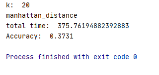
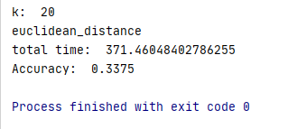

## 曼哈顿距离

计算公式: 
$$
d(x, y) = |x_1 - x_2 | + | y_1 + y_2 |
$$
算法表现:
* 在k=10，对数据进行归一化且使用kd-tree加速查找的情况下，使用曼哈顿距离作为超参数跑了421秒， 得分为0.381分(满分为1分)。

## 欧几里德距离

计算公式: 
$$
d(x, y) = \sqrt{\sum_{i=1}^n(x_i - y_i)^2}
$$
算法表现:

* 同样情况下使用欧几里德距离作为超参数，费时413秒，得分为0.3386分。

## 结论

根据结果我们可知同样情况下使用曼哈顿距离和欧几里德距离在时间复杂度方面差距极小，毕竟算法瓶颈在于查找的o(n3/2)。得分方面使用曼哈顿距离略高于欧几里得距离。  
我们换用ball-tree进行查找，将k改为20发现除了因为查找复杂度下降导致的耗时减少外，两种距离得分均略微降低，但曼哈顿距离任然优于欧几里得距离  

  
  