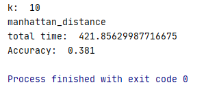

## 曼哈顿距离

计算公式: 
$$
d(x, y) = |x_1 - x_2 | + | y_1 + y_2 |
$$
算法表现:
* 在k=30，数据归一化，8个cpu全开且使用ball-tree加速查找的情况下，使用曼哈顿距离作为超参数跑了516秒， 得分为0.3686分(满分为1分)。

## 欧几里德距离

计算公式: 
$$
d(x, y) = \sqrt{\sum_{i=1}^n(x_i - y_i)^2}
$$
算法表现:

* 同样情况下使用欧几里德距离作为超参数，费时544秒，得分为0.3346分。

## 结论

根据结果我们可知同样情况下使用曼哈顿距离和欧几里德距离在时间复杂度方面差距极小，欧几里德距离由于需要求平方等操作，时间常数略大于曼哈顿距离，但得分方面欧几里德距离并没有明显领先曼哈顿距离，在k=30时反而表现略逊于曼哈顿距离。